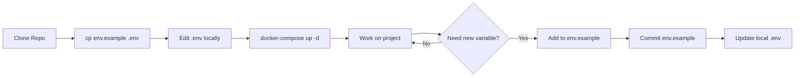
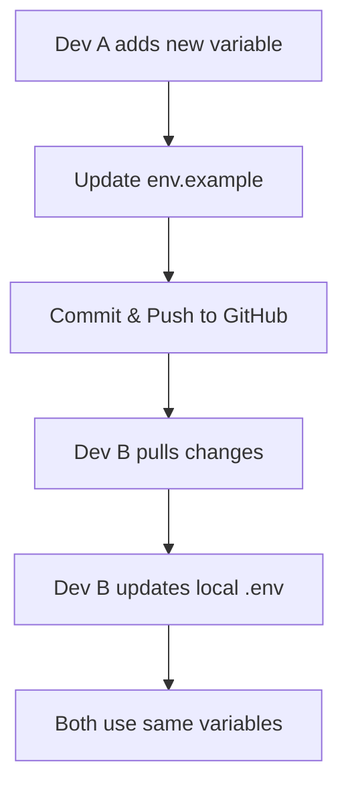

# 🔐 Environment Variables Setup Guide

## 📋 Tổng Quan

Dự án sử dụng **2 files** để quản lý environment variables:

| File | Mục đích | Git Status |
|------|----------|------------|
| **`env.example`** | Template với giá trị mặc định | ✅ Được commit lên GitHub |
| **`.env`** | File thực tế với credentials | ❌ **KHÔNG** được commit (trong .gitignore) |

---

## 🎯 Tại Sao Cần 2 Files?

### 1. **`env.example`** - Template File
- **Mục đích**: Là template/example cho người khác clone project
- **Nội dung**: Chứa tất cả biến cần thiết với giá trị mặc định KHÔNG bí mật
- **Git**: ✅ Được commit lên GitHub
- **Best practice**: Standard trong mọi dự án (NodeJS, Python, Docker, etc.)

### 2. **`.env`** - Actual Environment File  
- **Mục đích**: File thực tế được Docker Compose sử dụng
- **Nội dung**: Có thể chứa credentials thật, production secrets
- **Git**: ❌ KHÔNG được commit (bảo mật)
- **Tạo từ**: Copy từ `env.example` khi setup lần đầu

---

## 🚀 Hướng Dẫn Setup

### ⚡ Quick Start (Không cần .env)

**GOOD NEWS**: Từ version mới, bạn có thể chạy ngay mà KHÔNG cần tạo file `.env`!

```bash
# 1. Clone repository
git clone https://github.com/truonganpro/Data_Warehouse.git
cd Data_Warehouse

# 2. Khởi động services (tự động dùng default values)
docker-compose up -d

# ✅ DONE! Services sẽ dùng credentials mặc định từ env.example
```

### 🔧 Advanced Setup (Tùy chỉnh credentials)

Nếu bạn muốn thay đổi passwords hoặc sử dụng credentials khác:

```bash
# 1. Clone repository
git clone https://github.com/truonganpro/Data_Warehouse.git
cd Data_Warehouse

# 2. Tạo .env từ template
cp env.example .env

# 3. Chỉnh sửa credentials
nano .env  # hoặc vi, vim, code, etc.

# 4. Khởi động services
docker-compose up -d
```

### Kiểm Tra File Đã Tồn Tại

```bash
# Kiểm tra .env có tồn tại không
ls -la .env

# Nếu chưa có, tạo từ template
cp env.example .env
```

---

## 🔄 Cách Hoạt Động (Default Values)

### Docker Compose Environment Variable Substitution

`docker-compose.yaml` sử dụng cú pháp `${VARIABLE:-default_value}`:

```yaml
# Ví dụ trong docker-compose.yaml
environment:
  MYSQL_ROOT_PASSWORD: ${MYSQL_ROOT_PASSWORD:-root123}
  #                     ^^^^^^^^^^^^^^^^^^^^^^^^^^^^^^^^
  #                     |                        |
  #                     Tìm trong .env           Giá trị mặc định nếu không tìm thấy
```

**Cách hoạt động**:
1. Docker Compose tìm biến `MYSQL_ROOT_PASSWORD` trong file `.env`
2. Nếu **TÌM THẤY**: Sử dụng giá trị từ `.env`
3. Nếu **KHÔNG TÌM THẤY** (hoặc `.env` không tồn tại): Dùng `root123`

**Kết quả**:
- ✅ **Có `.env`**: Dùng credentials tùy chỉnh của bạn
- ✅ **Không có `.env`**: Dùng credentials mặc định (root123, minio123, etc.)
- ✅ **Cả 2 trường hợp đều KHÔNG BỊ LỖI!**

---

## 📝 Cấu Trúc File `env.example`

```bash
# ===========================================
# Modern Data Stack - Environment Variables
# ===========================================

# 🐬 MySQL Configuration
MYSQL_ROOT_PASSWORD=root123
MYSQL_DATABASE=metastore
MYSQL_USER=hive
MYSQL_PASSWORD=hive

# 🧊 PostgreSQL Configuration (Dagster)
POSTGRES_DB=postgres
POSTGRES_USER=admin
POSTGRES_PASSWORD=admin123

# 🪣 MinIO Configuration
MINIO_ROOT_USER=minio
MINIO_ROOT_PASSWORD=minio123

# 🔧 Optional: Custom Ports (commented out)
# SPARK_MASTER_PORT=7077
# SPARK_WORKER_PORT=8081
# TRINO_PORT=8082
# METABASE_PORT=3000
# DAGSTER_PORT=3001
```

---

## 🔒 Bảo Mật (Security Best Practices)

### ✅ ĐÚNG (Correct)
```bash
# .gitignore
.env              # ✅ Ignore file thực tế
.env.local
.env.production
```

```bash
# Git repository
env.example       # ✅ Commit template
```

### ❌ SAI (Wrong - NGUY HIỂM!)
```bash
# ❌ KHÔNG commit .env lên GitHub!
git add .env      # WRONG!
git commit -m "Add env file"  # WRONG!
```

**Tại sao nguy hiểm?**
- Lộ passwords, API keys
- Bất kỳ ai cũng có thể xem history
- Không thể xóa hoàn toàn khỏi Git history

---

## 🛠️ Khi Nào Cần Chỉnh Sửa?

### Chỉnh Sửa `env.example`
Khi thêm **biến môi trường mới** cho project:

```bash
# 1. Thêm vào env.example với giá trị mặc định
echo "NEW_SERVICE_PORT=8888" >> env.example

# 2. Commit lên GitHub
git add env.example
git commit -m "Add NEW_SERVICE_PORT variable"
git push

# 3. Đồng bộ vào .env local
cp env.example .env
# hoặc thêm thủ công vào .env
```

### Chỉnh Sửa `.env`
Khi cần **thay đổi credentials cục bộ**:

```bash
# Chỉnh sửa trực tiếp (không commit)
nano .env

# Ví dụ: Đổi password mạnh hơn cho production
MYSQL_ROOT_PASSWORD=SuperSecure@Password123!
```

---

## 🔍 Kiểm Tra Cấu Hình

### Verify Environment Variables Được Load

```bash
# Kiểm tra Docker Compose có đọc được .env không
docker-compose config | grep -A 5 "environment:"

# Kiểm tra biến trong container
docker exec de_mysql env | grep MYSQL
docker exec minio env | grep MINIO
```

### Debug Khi Services Không Chạy

```bash
# 1. Kiểm tra .env tồn tại
ls -la .env

# 2. Kiểm tra format (không có lỗi syntax)
cat .env

# 3. So sánh với template
diff env.example .env

# 4. Tạo lại nếu cần
cp env.example .env
docker-compose down
docker-compose up -d
```

---

## 📊 Các Biến Môi Trường Được Sử Dụng

### MySQL (Source Database)
```bash
MYSQL_ROOT_PASSWORD=root123        # Root password
MYSQL_DATABASE=metastore           # Database cho Hive Metastore
MYSQL_USER=hive                    # User cho Hive
MYSQL_PASSWORD=hive                # Password cho user hive
```

**Sử dụng trong**:
- `docker-compose.yaml` → `de_mysql` service
- Hive Metastore connection
- ETL pipeline bronze layer

### PostgreSQL (Dagster Backend)
```bash
POSTGRES_DB=postgres               # Database name
POSTGRES_USER=admin                # Admin user
POSTGRES_PASSWORD=admin123         # Admin password
```

**Sử dụng trong**:
- `docker-compose.yaml` → `de_postgres` service (nếu có)
- Dagster storage backend

### MinIO (S3-Compatible Storage)
```bash
MINIO_ROOT_USER=minio              # Access key
MINIO_ROOT_PASSWORD=minio123       # Secret key
```

**Sử dụng trong**:
- `docker-compose.yaml` → `minio` service
- Spark S3A configuration
- Trino catalog configuration
- MinIO Console login (http://localhost:9001)

---

## 🔄 Workflow Chuẩn

### Developer Workflow


### Team Collaboration


---

## ⚠️ Troubleshooting

### Problem 1: Services Không Khởi Động
**Triệu chứng**: Docker containers failed to start
```bash
Error: MySQL authentication failed
Error: MinIO access denied
```

**Giải pháp**:
```bash
# 1. Kiểm tra .env tồn tại
ls -la .env

# 2. Nếu không có, tạo từ template
cp env.example .env

# 3. Restart services
docker-compose down
docker-compose up -d
```

### Problem 2: Credentials Không Khớp
**Triệu chứng**: Connection errors giữa services

**Giải pháp**:
```bash
# 1. So sánh với template
diff env.example .env

# 2. Đảm bảo format đúng (không có space thừa)
# WRONG: MYSQL_PASSWORD = hive
# RIGHT: MYSQL_PASSWORD=hive

# 3. Recreate containers với credentials mới
docker-compose down -v  # -v để xóa volumes
docker-compose up -d
```

### Problem 3: Git Accidentally Staged .env
**Triệu chứng**: `git status` shows `.env` as staged

**Giải pháp**:
```bash
# 1. Unstage file
git reset HEAD .env

# 2. Đảm bảo .gitignore có .env
grep "^\.env$" .gitignore

# 3. Nếu chưa có, thêm vào
echo ".env" >> .gitignore
git add .gitignore
git commit -m "Add .env to gitignore"
```

---

## 📚 Best Practices Summary

### ✅ DO (Nên Làm)
1. ✅ Luôn commit `env.example`
2. ✅ Thêm `.env` vào `.gitignore`
3. ✅ Document các biến mới trong README
4. ✅ Sử dụng giá trị mặc định an toàn trong `env.example`
5. ✅ Tạo `.env` từ template khi clone project

### ❌ DON'T (Không Nên)
1. ❌ KHÔNG commit `.env` lên GitHub
2. ❌ KHÔNG hardcode credentials trong code
3. ❌ KHÔNG share `.env` qua email/chat
4. ❌ KHÔNG sử dụng production credentials trong `env.example`
5. ❌ KHÔNG bỏ qua việc document biến môi trường mới

---

## 🎓 Tài Liệu Tham Khảo

- [The Twelve-Factor App - Config](https://12factor.net/config)
- [Docker Compose Environment Variables](https://docs.docker.com/compose/environment-variables/)
- [GitHub Security Best Practices](https://docs.github.com/en/code-security/getting-started/best-practices-for-preventing-data-leaks-in-your-organization)

---

**💡 Remember**: `env.example` is for sharing, `.env` is for secrets! 🔐

