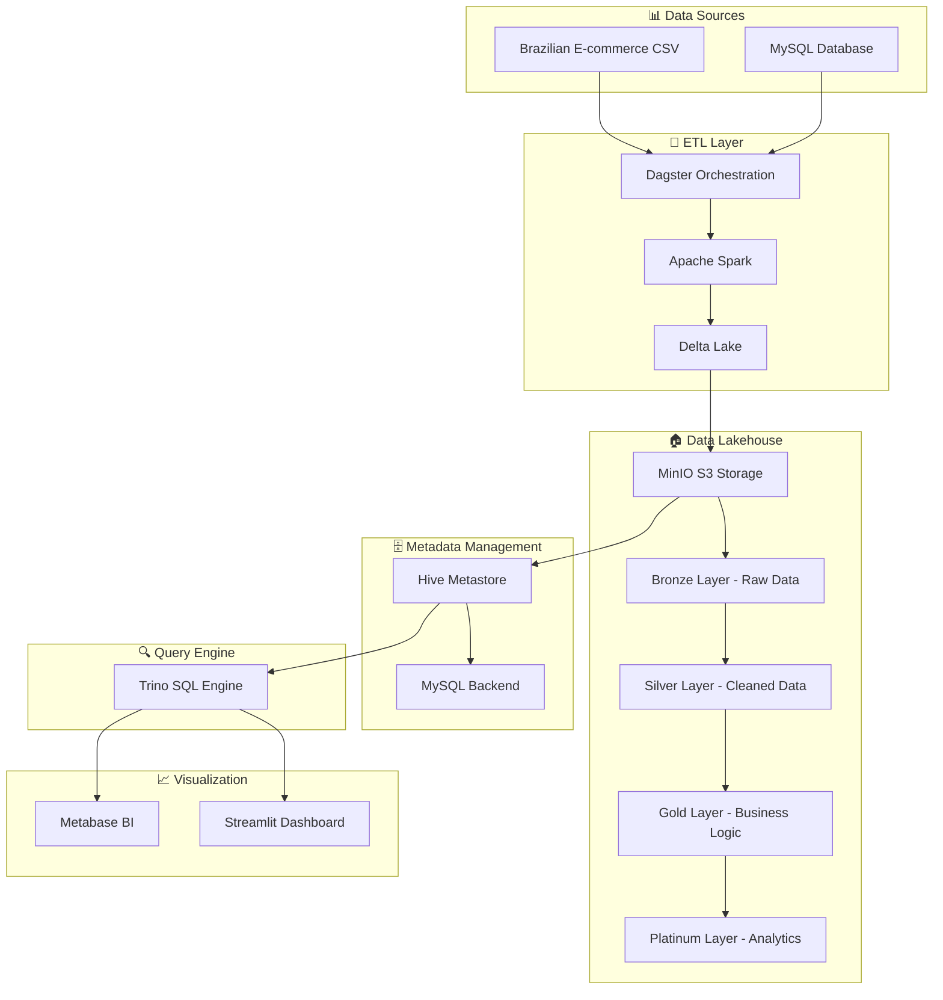

# 🏗️ Modern Data Stack - Data Lakehouse Project

> **Ứng dụng Modern Data Stack (MDS) để xây dựng Data Lakehouse hỗ trợ phân tích dữ liệu bán hàng thương mại điện tử**

[](https://www.docker.com/)
[](https://spark.apache.org/)
[](https://delta.io/)
[](https://trino.io/)
[](https://dagster.io/)
[](https://www.metabase.com/)

## 📋 Mục lục

- [🎯 Tổng quan dự án](#-tổng-quan-dự-án)
- [🏗️ Kiến trúc hệ thống](#️-kiến-trúc-hệ-thống)
- [🛠️ Công nghệ sử dụng](#️-công-nghệ-sử-dụng)
- [🚀 Cài đặt và chạy](#-cài-đặt-và-chạy)
- [📊 Cấu trúc dữ liệu](#-cấu-trúc-dữ-liệu)
- [🔄 Quy trình ETL](#-quy-trình-etl)
- [📈 Dashboard và BI](#-dashboard-và-bi)
- [🔧 Cấu hình](#-cấu-hình)
- [📚 Tài liệu tham khảo](#-tài-liệu-tham-khảo)

## 🎯 Tổng quan dự án

### Mục tiêu
Xây dựng một hệ thống Data Lakehouse hoàn chỉnh sử dụng Modern Data Stack để:
- **Thu thập và xử lý** dữ liệu thương mại điện tử Brazilian E-commerce
- **Tổ chức dữ liệu** theo mô hình medallion (Bronze → Silver → Gold → Platinum)
- **Phân tích và trực quan hóa** dữ liệu qua BI dashboard
- **Triển khai container hóa** với Docker Compose

### Dataset
- **Brazilian E-commerce Dataset**: Dữ liệu bán hàng thương mại điện tử Brazil
- **Nguồn**: [Kaggle - Brazilian E-commerce Public Dataset](https://www.kaggle.com/datasets/olistbr/brazilian-ecommerce)
- **Kích thước**: ~100K đơn hàng, 32K sản phẩm, 9K người bán

## 🏗️ Kiến trúc hệ thống



## 🛠️ Công nghệ sử dụng

| **Thành phần** | **Công nghệ** | **Vai trò** |
|----------------|---------------|-------------|
| **Storage** | MinIO (S3-compatible) | Lưu trữ dữ liệu theo zone |
| **Metadata** | Hive Metastore + MySQL | Quản lý schema và metadata |
| **Compute** | Apache Spark 3.3.2 | Xử lý dữ liệu (ETL) |
| **Lakehouse** | Delta Lake 2.3.0 | ACID transactions, versioning |
| **Query Engine** | Trino 414 | SQL query trên Delta tables |
| **Orchestration** | Dagster | Workflow management |
| **BI/Visualization** | Metabase + Streamlit | Dashboard và báo cáo |
| **Containerization** | Docker Compose | Triển khai và quản lý |

## 🚀 Cài đặt và chạy

### Yêu cầu hệ thống
- Docker & Docker Compose
- 8GB RAM trở lên
- 20GB dung lượng trống

### 1. Clone repository
```bash
git clone <repository-url>
cd DATALAKEHOUSE
```

### 2. Khởi động hệ thống
```bash
# Tạo file .env
cp .env.example .env

# Khởi động tất cả services
docker-compose up -d

# Hoặc chạy script tự động
chmod +x start_and_test.sh
./start_and_test.sh
```

### 3. Kiểm tra trạng thái
```bash
# Kiểm tra containers
docker-compose ps

# Xem logs
docker-compose logs -f [service_name]
```

### 4. Truy cập các giao diện
- **Spark Master UI**: http://localhost:8080
- **MinIO Console**: http://localhost:9001 (minio/minio123)
- **Metabase**: http://localhost:3000
- **Trino**: http://localhost:8082
- **Dagster**: http://localhost:3001

## 📊 Cấu trúc dữ liệu

### Data Lakehouse Layers

```
/lakehouse/
├── bronze/          # Raw data (CSV → Parquet)
│   ├── customers/
│   ├── orders/
│   ├── order_items/
│   └── ...
├── silver/          # Cleaned & normalized
│   ├── cleaned_customers/
│   ├── cleaned_orders/
│   └── ...
├── gold/            # Business logic & facts
│   ├── fact_orders/
│   ├── dim_customers/
│   └── ...
└── platinum/        # Analytics & cubes
    ├── sales_summary/
    ├── customer_segments/
    └── ...
```

### Schema Design

#### Fact Tables (Gold Layer)
- **fact_orders**: Đơn hàng chính với metrics
- **fact_order_items**: Chi tiết sản phẩm trong đơn hàng
- **fact_payments**: Thông tin thanh toán

#### Dimension Tables (Gold Layer)
- **dim_customers**: Thông tin khách hàng
- **dim_products**: Thông tin sản phẩm
- **dim_sellers**: Thông tin người bán
- **dim_geolocation**: Thông tin địa lý
- **dim_dates**: Bảng thời gian

## 🔄 Quy trình ETL

### 1. Extract (Dagster Assets)
```python
@asset
def extract_customers():
    """Extract customer data from CSV"""
    return spark.read.csv("s3a://lakehouse/bronze/customers/")

@asset
def extract_orders():
    """Extract order data from CSV"""
    return spark.read.csv("s3a://lakehouse/bronze/orders/")
```

### 2. Transform (Silver Layer)
```python
@asset
def clean_customers(extract_customers):
    """Clean and normalize customer data"""
    return extract_customers \
        .filter(col("customer_id").isNotNull()) \
        .withColumn("customer_zip_code_prefix", 
                   col("customer_zip_code_prefix").cast("int"))
```

### 3. Load (Gold Layer)
```python
@asset
def create_fact_orders(clean_orders, clean_order_items):
    """Create fact table for orders"""
    return clean_orders \
        .join(clean_order_items, "order_id") \
        .groupBy("order_id") \
        .agg(
            sum("price").alias("total_price"),
            count("order_item_id").alias("item_count")
        )
```

## 📈 Dashboard và BI

### Metabase Dashboards
1. **Sales Overview**: Tổng quan doanh thu
2. **Customer Analysis**: Phân tích khách hàng
3. **Product Performance**: Hiệu suất sản phẩm
4. **Geographic Analysis**: Phân tích theo địa lý

### Streamlit Applications
- **Real-time Analytics**: Phân tích thời gian thực
- **Customer Segmentation**: Phân khúc khách hàng
- **Sales Forecasting**: Dự báo doanh thu

## 🔧 Cấu hình

### Environment Variables (.env)
```bash
# MySQL
MYSQL_ROOT_PASSWORD=root123
MYSQL_DATABASE=metastore
MYSQL_USER=hive
MYSQL_PASSWORD=hive

# PostgreSQL (Dagster)
POSTGRES_DB=postgres
POSTGRES_USER=admin
POSTGRES_PASSWORD=admin123

# MinIO
MINIO_ROOT_USER=minio
MINIO_ROOT_PASSWORD=minio123
```

### Spark Configuration
```properties
# S3/MinIO
spark.hadoop.fs.s3a.endpoint=http://minio:9000
spark.hadoop.fs.s3a.access.key=minio
spark.hadoop.fs.s3a.secret.key=minio123

# Delta Lake
spark.sql.extensions=io.delta.sql.DeltaSparkSessionExtension
spark.sql.catalog.spark_catalog=org.apache.spark.sql.delta.catalog.DeltaCatalog
```

### Trino Configuration
```properties
# Hive connector
hive.metastore.uri=thrift://hive-metastore:9083
hive.s3.endpoint=http://minio:9000
hive.s3.aws-access-key=minio
hive.s3.aws-secret-key=minio123
```

## 🧪 Testing

### Test kết nối Spark ↔ MinIO
```bash
# Chạy test script
python test_spark_minio_connection.py

# Hoặc qua Docker
docker exec spark-master python3 /opt/bitnami/spark/test_spark_minio_connection.py
```

### Test SQL queries
```sql
-- Trino
SELECT * FROM hive.default.customers LIMIT 10;

-- Spark SQL
SELECT * FROM delta.`s3a://lakehouse/gold/fact_orders` LIMIT 10;
```

## 📚 Tài liệu tham khảo

### Công nghệ chính
- [Apache Spark Documentation](https://spark.apache.org/docs/latest/)
- [Delta Lake Documentation](https://docs.delta.io/)
- [Trino Documentation](https://trino.io/docs/)
- [Dagster Documentation](https://docs.dagster.io/)
- [Metabase Documentation](https://www.metabase.com/docs/)

### Modern Data Stack
- [What is a Data Lakehouse?](https://www.databricks.com/discover/data-lakehouse)
- [Modern Data Stack Architecture](https://www.getdbt.com/what-is-analytics-engineering/)
- [Data Engineering Best Practices](https://github.com/datastacktv/data-engineer-roadmap)

### Dataset
- [Brazilian E-commerce Dataset](https://www.kaggle.com/datasets/olistbr/brazilian-ecommerce)

## 🤝 Đóng góp

1. Fork repository
2. Tạo feature branch (`git checkout -b feature/AmazingFeature`)
3. Commit changes (`git commit -m 'Add some AmazingFeature'`)
4. Push to branch (`git push origin feature/AmazingFeature`)
5. Tạo Pull Request

## 📄 License

Distributed under the MIT License. See `LICENSE` for more information.

## 👨‍💻 Tác giả

**Truong An** - *Modern Data Stack Engineer*


## 🙏 Acknowledgments

- [Olist](https://olist.com/) for providing the Brazilian E-commerce dataset
- [Apache Software Foundation](https://apache.org/) for open-source tools
- [Modern Data Stack community](https://github.com/modern-data-stack) for inspiration

---

⭐ **Nếu dự án này hữu ích, hãy cho một star!** ⭐
